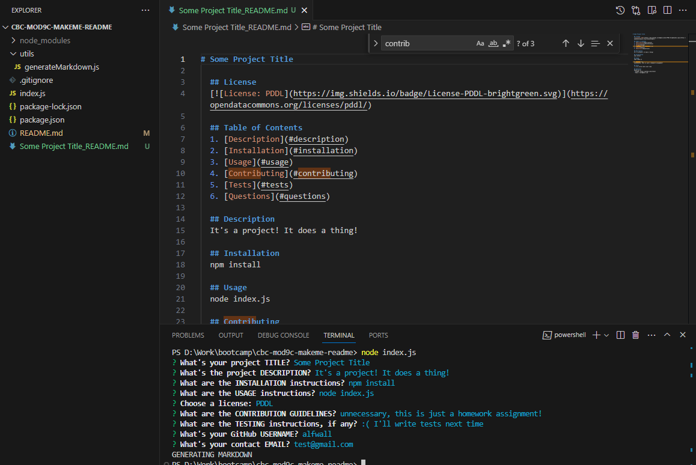

# MakeMe ReadMe

## Description
Command line program that requests the contents for a README that is generated after.

## The Result

## Credits
- [The starter code that this was built off of](https://github.com/coding-boot-camp/potential-enigma)

## TODO
- [x] Create README for this project
- [x] Install Inquirer with `npm i inquirer@8.2.4`
- [x] Prompt for each necessary thing: 
    - [x] Project Title
    - [x] Description
    - [x] Installation Instructions
    - [x] Usage Information
    - [x] License
        - [x] Provide a LIST OF OPTIONS (request number entry of options?)
        - [x] "a badge for that license is added near the top of the README" (see: https://gist.github.com/lukas-h/2a5d00690736b4c3a7ba)
    - [x] Contribution Guidelines
    - [x] Test Instructions
    - [x] FAQ (Questions)
        - [x] Request GitHub username
        - [x] Link to Github Profile
        - [x] Request email
        - [x] "instructions on how to reach me with additional questions"
    - [x] Table of Contents
        - [x] Has links to each section
- [x] Record video demo

## User Story
AS A developer,
I WANT a README generator
SO THAT I can quickly create a professional README for a new project.

## Acceptance Criteria
GIVEN a command-line application that accepts user input...

WHEN I am prompted for information about my application repository,
THEN a high-quality, professional README.md is generated with the title of my project and sections entitled Description, Table of Contents, Installation, Usage, License, Contributing, Tests, and Questions.

WHEN I enter my project title,
THEN this is displayed as the title of the README.

WHEN I enter a description, installation instructions, usage information, contribution guidelines, and test instructions,
THEN this information is added to the sections of the README entitled Description, Installation, Usage, Contributing, and Tests.

WHEN I choose a license for my application from a list of options,
THEN a badge for that license is added near the top of the README and a notice is added to the section of the README entitled License that explains which license the application is covered under.

WHEN I enter my GitHub username,
THEN this is added to the section of the README entitled Questions, with a link to my GitHub profile.

WHEN I enter my email address,
THEN this is added to the section of the README entitled Questions, with instructions on how to reach me with additional questions.

WHEN I click on the links in the Table of Contents,
THEN I am taken to the corresponding section of the README.